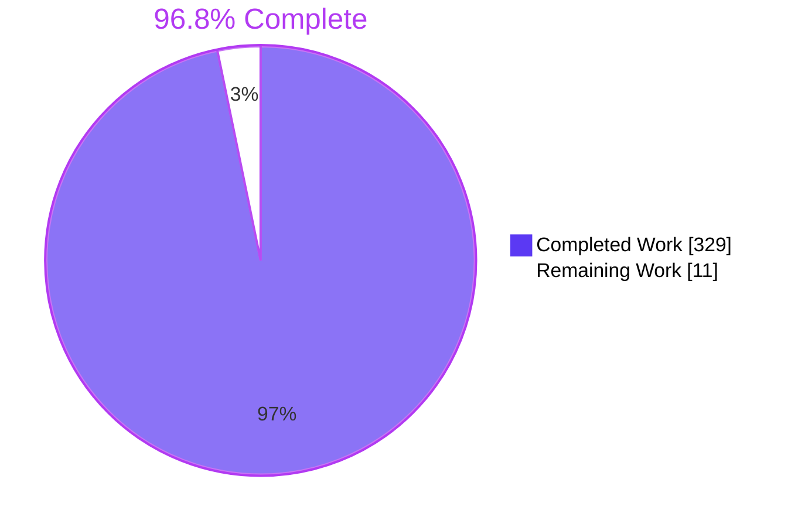
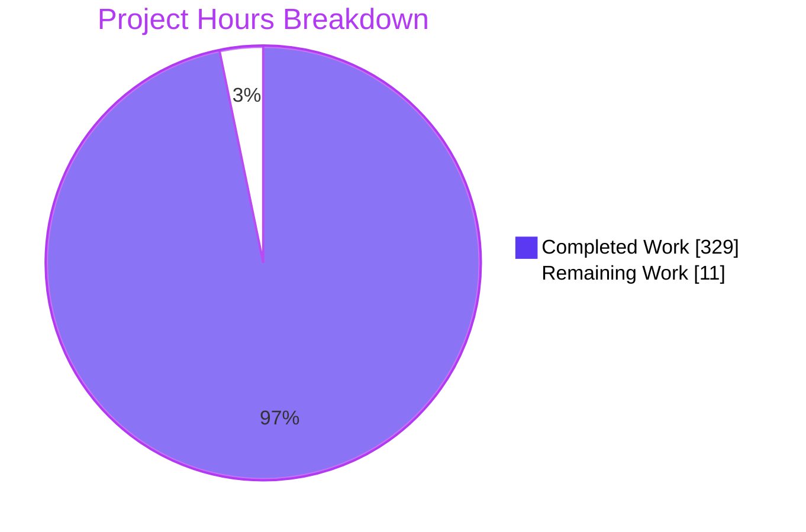
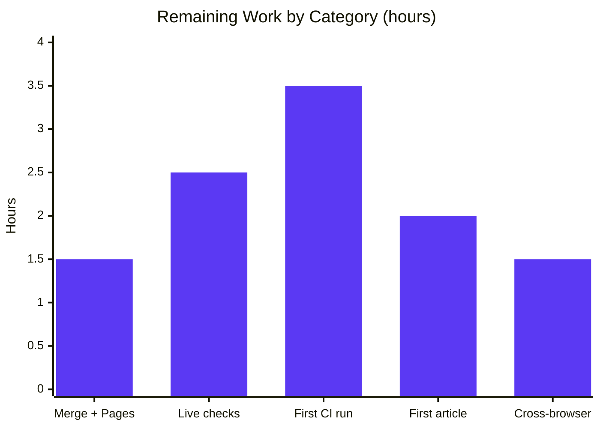

# 1. Executive Summary

## 1.1 Project Overview

Cabrillo Coast's static GitHub Pages site gains a technical blog. The owner drafts Markdown articles privately and publishes by pushing to `main`, which requires GitHub write access. Visitors browse `/blog/`, read `/blog/<slug>/` and search full text in the browser. Rendering uses the Jekyll build that Pages already runs, and no server, accounts or third-party scripts are added. Git-ignored draft folders, a publishing CLI and commit and push guards keep drafts out of the public repository. A single verification gate checks every change.

## 1.2 Completion Status



| Metric | Value |
|---|---|
| Total Hours | 340 |
| Completed Hours (AI + Manual) | 329 (329 AI + 0 manual) |
| Remaining Hours | 11 |
| Percent Complete | 96.8% |

329 of 340 hours are complete: 329 ÷ 340 × 100 = 96.8%.

## 1.3 Key Accomplishments

- ✅ The listing, article layout, launch state and search index build with the pinned Pages gem set (github-pages 232)
- ✅ Private publishing: `new`/`check`/`publish`/`unpublish`, plus guards that refuse drafts, `published:` keys, future dates and orphan images
- ✅ Weighted, diacritic-insensitive full-text search with a lazy index fetch and shareable `?q=` URLs, in 4,988 of 5,000 B
- ✅ Every blog page has a strict CSP, escaped output and an unsafe-markup scan
- ✅ The home page gains Blog links and a labelled menu landmark. Its budgets hold, and `main.js` and `CNAME` are unchanged
- ✅ `node scripts/verify.mjs` passes: 1,226 + 43 tests, 0 failures, 12 of 12 screenshots identical
- ✅ The README documents setup, publishing, safeguards, residual risk and re-pinning

## 1.4 Critical Unresolved Issues

**4 of 21** AAP acceptance checks are open: the four after-deployment checks. AC-01 to AC-17 pass. The `blog-checks` workflow has not yet run on GitHub. No code defect is open.

| Issue | Impact | Owner | ETA |
|---|---|---|---|
| After-deployment checks not yet run (4 of 4): live `/blog/` 200 and home-page link; live `<main>` byte-equal to a local build; `/README.md` returns 404; HC-1 to HC-7 | Pages-builder parity is unconfirmed until the branch deploys | Site owner | Within 1 day of merge (4h incl. merge) |
| `.github/workflows/blog-checks.yml` has never run on GitHub Actions (1 component) | CI reporting is unproven on the `ubuntu-24.04` runner | Site owner | First pull request (3.5h) |

## 1.5 Access Issues

No access issues identified. Every build, test and preview ran with the installed toolchain. Merging to `main` uses the owner's existing write access.

## 1.6 Recommended Next Steps

1. [High] Merge to `main` through a pull request, and confirm Pages serves the `https://www.cabrillocoast.com/blog/` launch state.
2. [High] Run the four after-deployment checks, including the live `<main>` byte comparison.
3. [Medium] Watch the first `blog-checks` runs, on the pull request and on the merge push.
4. [Medium] Publish the first article from a clone with `git config core.hooksPath .githooks`, and verify it live.
5. [Low] Spot-check the blog in Safari with VoiceOver and in Firefox.

# 2. Project Hours Breakdown

## 2.1 Completed Work Detail

| Component | Hours | Description |
|---|---|---|
| Jekyll configuration and pins | 6 | `_config.yml` (theme off, `future: false`, `permalink`, explicit `exclude`, post defaults), `_config.preview.yml`, `Gemfile`/`Gemfile.lock` (github-pages 232, nokogiri 1.16.7), `.ruby-version`, `package.json`/lock, `.gitignore` entries |
| Layouts and chrome includes | 10 | `_layouts/blog.html` (CSP placed right after charset, escaped metadata, canonical and Open Graph), `_layouts/post.html`, and `_includes/site-header.html` and `site-footer.html`, both matching the home page's markup |
| Listing page and launch state | 4 | `blog/index.html`: newest-first ordered list, hidden search form, `data-url` join and the empty-state message |
| Blog stylesheet | 14 | `blog/blog.css` (7,993 B): tokens only, dark mode, prose, tables, code and Rouge tokens, focus and scroll padding, mobile-menu height cap, forced-colours support |
| Search index and in-browser search | 16 | `blog/search.json` (Liquid full-text index with entity decoding and distinct tokens) and `blog/search.js` (ES5, `normalize`/`tokenize`/`prepare`/`rank`, lazy fetch, debounce, `?q=` sync, bidi-isolated status) |
| Home page integration | 4 | Three Blog links and `nav#mobile-menu[aria-label="Primary"]` in `index.html`; brand, nav, footer-wrap and 900px nav-switch rules in `styles.css` |
| Article template | 1 | `_templates/article.md` with placeholder markers that `check` refuses |
| Content rule engines | 56 | `scripts/lib/articles.mjs`: restricted YAML parser, schema, kramdown-faithful code regions, unsafe-markup and image scanners, inbound references, tracked-content rules. `scripts/lib/site-config.mjs`: refuses configuration that would hide posts |
| Publishing CLI | 40 | `scripts/article.mjs`: `new`, `check`, `publish` and `unpublish` with locking and rollback, `guard --staged`, and `guard --pre-push` over every pushed commit and tree |
| Git hooks | 2 | `.githooks/pre-commit` and `pre-push`, mode 100755, exec-ing `guard` |
| Verification entry point | 14 | `scripts/verify.mjs` (5 ordered steps, Chromium preflight, environment hygiene) plus `scripts/lib/subprocess.mjs` and `tests/visual/lib/preflight.mjs` |
| CI workflow | 4 | `.github/workflows/blog-checks.yml`: `ubuntu-24.04`, pinned actions, base selection, report upload on failure |
| Static and built-output suites | 48 | `blog-content`, `site-chrome`, `built-pages`, `built-search-index` and the shared `tests/static/lib/site-links.mjs` link checker |
| Unit suites | 50 | `article-cli`, `search`, `site-links`, `fixture-staging`, `subprocess`, `verify`, `run-visual`, `visual-gate` and `visual-pixels` suites, with the shared harness |
| Fixtures and fixture builder | 10 | Two fixture articles; `tests/fixtures/build-fixture-site.mjs` builds the project-path, preview and empty variants with synthetic private content |
| Visual comparison | 18 | `tests/visual/` config, spec, `run-visual.mjs` and the pixel comparator: 12 screenshots compared at zero tolerance, with the intended-change trailer |
| Documentation | 8 | README: stack, file map, setup, preview, checks, publishing how-to, safeguards and residual risk, unpublishing, search budget, deploy and re-pin notes |
| Browser acceptance validation | 12 | AC-11 to AC-15 in Chromium: preview, layouts at 3 widths × 2 schemes, contrast, keyboard, search and fetch counts, navigation widths, contact form |
| Security verification | 12 | Adversarial probes of the draft-privacy chain, the source and built-page scanners, the CSP and the search status output |
| **Total** | **329** | |

## 2.2 Remaining Work Detail

| Category | Hours | Priority |
|---|---|---|
| [Path-to-production] Merge to `main` and confirm the Pages legacy build and custom domain serve `/blog/` | 1.5 | High |
| [Path-to-production] After-deployment checks: live `/blog/` 200, `<main>` equivalence, `/README.md` 404, HC-1 to HC-7 | 2.5 | High |
| [Path-to-production] First `blog-checks` run on GitHub Actions (pull request and push), runner triage, artifact upload confirmed, first real `guard --pre-push` against GitHub | 3.5 | Medium |
| [Path-to-production] First live article published from a hooks-enabled clone, live article `<main>` check, and cleanup of the `_drafts/.<slug>.publish-backup` it leaves | 2 | Medium |
| [Path-to-production] Safari with VoiceOver, and Firefox, spot-check of the blog pages | 1.5 | Low |
| **Total** | **11** | |

## 2.3 Hours Calculation

- Completed hours: 329, the sum of Section 2.1. Every AAP deliverable is complete.
- Remaining hours: 11, the sum of Section 2.2. All of it is path-to-production work.
- Total project hours: 329 + 11 = 340
- Completion: 329 ÷ 340 × 100 = **96.8%**
- Confidence: high for completed hours, which rest on observed test runs and the tree. Medium for remaining hours, because the first CI run on GitHub's runner may need extra triage.

# 3. Test Results

All figures below come from `node scripts/verify.mjs --base origin/main`, which exited 0 on Node 24.21.0 and Ruby 3.3.4, and from a per-file run of each suite. Real-build counts are against `_site` with an empty base path. Skipped cases are fixture-only or real-build-only by design, and each runs in the other mode. No coverage tool is configured for this project.

| Area / Category | Framework | Tests | Passed | Failed | Coverage | What This Proves |
|---|---|---|---|---|---|---|
| Content, privacy and configuration rules (`tests/static/blog-content.test.mjs`) | node:test | 565 | 565 | 0 | Not measured | Nothing private is tracked, every article meets the schema and image rules, and the config, hooks and pins are exactly as specified (AC-01, AC-04) |
| Publishing CLI and guards (`tests/unit/article-cli.test.mjs`) | node:test | 376 | 376 | 0 | Not measured | `new`/`check`/`publish`/`unpublish` move, rewrite and refuse correctly, and both guards refuse every forbidden tree, run in temporary git repositories (AC-03) |
| Home page and site chrome (`tests/static/site-chrome.test.mjs`) | node:test | 26 | 26 | 0 | Not measured | The 7/7/5 navigation matches the includes, PT-1/PT-2/PT-4 hold, and `search.js` is ES5 with no HTML-writing sinks (AC-10) |
| Search logic and index (`tests/unit/search.test.mjs`, `tests/static/built-search-index.test.mjs`) | node:test | 28 (5 skipped) | 23 | 0 | Not measured | Ranking, AND matching, literal and diacritic-insensitive terms all work, and the built index is valid, ordered, decoded and within budget (AC-08, AC-09) |
| Built pages and link checker (`tests/static/built-pages.test.mjs`, `tests/unit/site-links.test.mjs`) | node:test | 58 (6 skipped) | 52 | 0 | Not measured | The page contract (doctype, CSP, scripts, metadata) holds, prose is clean, every local link and fragment resolves, outputs are correct and the launch state renders (AC-06, AC-07, AC-17) |
| Verification tooling (`fixture-staging`, `subprocess`, `verify`, `run-visual`, `visual-gate`, `visual-pixels` suites) | node:test | 173 | 173 | 0 | Not measured | The gate, fixture builder, process deadlines and visual-change rules behave as documented |
| Fixture project-path build (`built-*` re-run at `/cabrillo-coast`, github.io host) | node:test | 43 (1 skipped) | 42 | 0 | Not measured | Escaping, Rouge output, `` handling and the project-path URLs are correct, and the draft, its image and the future post never reach a normal build (AC-02, AC-05, AC-07) |
| Visual comparison (`tests/visual/run-visual.mjs --base 72b7427`) | Playwright 1.63.0 (Chromium) | 12 | 12 | 0 | Not measured | The listing and an article at 375/800/1280 px, in light and dark, are pixel-identical to the base revision |

The six node:test rows of the real-build run total 1,226 tests: 1,215 passed, 0 failed, 11 skipped.

**Not Covered**

- **The GitHub Pages builder itself.** Builds use the same Ruby and gem versions, but the `<main>` equivalence check against the live site needs a deployment.
- **`.github/workflows/blog-checks.yml` on a GitHub runner.** Its steps run locally through `scripts/verify.mjs`, but the workflow file has never run on GitHub.
- **Search interaction wiring:** lazy fetch, debounce, `?q=` sync, Escape and the unavailable status. As the AAP specifies, no automated test covers these; they were exercised only in headless Chrome. Re-test them by hand after any `blog/search.js` change.
- **Browser acceptance checks AC-11 to AC-15.** These were one-time Chromium passes, not repeatable tests. Safari (including VoiceOver) and Firefox were not tested.
- **`guard --pre-push` against credentialed SSH or HTTPS remotes.** Only local bare remotes were exercised. Its first real push is the test.
- **Defensive branches:** stale-lock replacement under a simultaneous race, rollback copy without hard links, reporting an unreadable backup, the visual runner's 30 s stalled-response deadline, and the `max-height: calc(100vh - 153px)` fallback for browsers without `dvh`.
- **Contact form against the real `formsubmit.co`.** Only the network-error path was driven.

# 4. Runtime Validation & UI Verification

Runtime checks drove the fixture site (two fixture articles, a synthetic draft with its image, and a future-dated post) and the real working tree in headless Chromium, both served on `127.0.0.1`. Authentication does not apply: the site has no accounts, and the publishing privilege is GitHub write access.

- ✅ **Build and private preview.** `bundle exec jekyll build` exits 0. `jekyll serve --drafts --config _config.yml,_config.preview.yml` returns 200 for `/`, `/blog/`, articles and `search.json`, and renders drafts and their images only in the preview. A normal build leaves out both the draft and its index entry (AC-11).
- ✅ **Publishing flow.** In a clone with the hooks enabled, `new` → `check` → `publish` → commit is accepted. A force-added `_drafts/` file is refused at commit with "drafts and draft images must never be tracked". `unpublish` restores the draft and prints the `git rm` and commit lines.
- ✅ **Listing and article pages (AC-12).** Tested at 375, 800 and 1280 px in light and dark. There is no page-level horizontal scroll, and code and tables scroll in their own boxes. Rouge highlighting is applied, and body text, links and code tokens reach at least 4.5:1 contrast. Tab order and focus rings work, and Blog carries `aria-current`. There were 0 console errors and 0 CSP violations, and only the site's own origin and the Google Fonts origins were contacted.
- ✅ **Search (AC-13).** No `search.json` request is made before focus and exactly one after. A `?q=<tag>` landing makes one fetch at load. Title and body-only terms are ranked with counts. `zzzz` shows the no-results status, and Escape restores the order and the URL. A stalled index shows the "unavailable" status after 15 s with the list intact. Right-to-left override characters in queries are isolated in the status line.
- ✅ **Without JavaScript.** The listing is complete and the search form stays hidden.
- ✅ **Navigation and mobile menu (AC-14).** At 1280, 1000 and 901 px the desktop row is one line with the logo visible. At 900 px and below the hamburger toggles `aria-expanded`, and the open menu is the "Primary" navigation landmark. On blog pages the open menu is height-capped and scrolls. The footer wraps with no overflow at 320, 360 and 375 px.
- ⚠ **Home page menu at short landscape heights.** Below about 461 px of viewport height, the open home-page menu cannot scroll. Blog pages are capped, but the home page is limited to the specified `styles.css` edits. In forced-colours mode the hamburger bars are invisible on all pages; this was already the case before the blog.
- ✅ **Home page and contact form (AC-15).** The `index.html` diff is exactly three Blog lines plus the `nav` open and close tags, and `main.js` is unchanged. An empty submit shows native validation. With `formsubmit.co` blocked, the existing network-error status appears and the button re-enables.
- ✅ **Project-path mode.** Under `/cabrillo-coast/`, navigation, `search.json` (200) and canonical/`og:url` values stay under the base path.
- ⚠ **Live integrations, not yet exercised.** The production Pages build at `www.cabrillocoast.com`, the GitHub Actions run and real FormSubmit delivery have not been driven. They wait on the merge to `main` (Section 2.2).

# 5. Compliance & Quality Review

## 5.1 Compliance Matrix

| AAP Deliverable / Benchmark | Evidence | Status | Progress |
|---|---|---|---|
| R1 Technical articles: Markdown, fenced and inline code, tables, images, links | AC-04, AC-05 suites; fixture articles render with Rouge classes and survive `` | ✅ Pass | 100% |
| R2 Private publishing: git-ignored drafts, CLI, commit and push guards | AC-01, AC-02, AC-03 (565 + 376 tests); preview-only drafts (AC-11) | ✅ Pass | 100% |
| R3 Public viewing: listing, article, navigation, launch state | AC-06, AC-07, AC-17 suites; AC-12 and AC-14 browser passes | ✅ Pass | 100% |
| R4 Search over title, summary, tags and full text | AC-08, AC-09 suites; AC-13 browser pass | ✅ Pass | 100% |
| Home page intact: 7/7/5 links, `nav` landmark, PT-1 216,505 of 237,954 B, PT-2 3,281 of 3,609 B, PT-4 = 5 | AC-10 suite; AC-15 diff and browser checks | ✅ Pass | 100% |
| Content security: exact CSP meta, escaped output, `textContent` only, no third-party JavaScript | Page contract, prose scan and sink scan; 0 CSP violations in browser | ✅ Pass | 100% |
| JavaScript conventions: ES5 strict IIFE, null-guarded DOM, `search.js` ≤ 5,000 B (4,988) | ES5 scanner self-test and budget test in `site-chrome.test.mjs` | ✅ Pass | 100% |
| Styling conventions: tokens only, dark mode, 900/720 px breakpoints, `blog.css` ≤ 8,000 B (7,993) | Budget test; visual comparison 12/12 | ✅ Pass | 100% |
| Pages parity: github-pages 232, nokogiri 1.16.7, Ruby 3.3.4, no `baseurl`, never `JEKYLL_ENV=production` | AC-01 lock and pin checks; build exit 0 | ⚠ Local parity verified; live equivalence pending | 90% |
| Both deployment modes: custom domain and `/cabrillo-coast` project path | AC-07 link, canonical and CNAME checks on both builds | ✅ Pass | 100% |
| Verification: `scripts/verify.mjs` gate and `blog-checks` workflow | Gate exit 0, 5/5 steps; workflow content matches the AAP | ⚠ Gate passes; workflow not yet run on GitHub | 90% |
| Test conventions and documentation: `[AC-xx][F-0xx]` titles, `node:test`, `.spec.mjs`, README how-to | Suite titles; README sections for setup, publishing, safeguards and deploy | ✅ Pass | 100% |

## 5.2 AAP & Rule Divergences and Gaps

No user rules were supplied, so each divergence below is measured against the AAP.

| What the AAP/Rule Required | What Was Delivered Instead | Why It Diverged | Impact | Remediation |
|---|---|---|---|---|
| AAP 0.5.2: `publish` and `unpublish` move the file | The move happens, and the retired file is also kept as a git-ignored `_drafts/.<slug>.<command>-backup` (`-backup-2` to `-backup-99`) | Never delete a file an editor may still have open | Dot-files accumulate in `_drafts/`. They are never built or tracked | Delete backups periodically (first cleanup in Section 2.2) |
| AAP 0.6.2: new-branch range `git rev-list <local> --not --remotes`; hook takes no arguments | Only commits the push destination advertises (`git ls-remote`) are skipped; the hook passes `-- "$@"` | The literal rule exempted commits held only on another remote | Pre-push contacts the destination. It fails closed if that query hangs | Confirm on the first real push (Section 2.2) |
| AAP 0.6.1: 36 listed new files; `node:test` suites use Node built-ins | 11 more modules and suites; the visual-tooling suites load the pinned `@playwright/test` | Shared config rules, process deadlines and a testable visual gate | Larger codebase; `node --test` needs `npm ci` first | None required |
| AAP 0.5.2 four tracked-content rules; 0.6.2 simple fence and inline-code scan | Stricter refusals (folders, links, submodules, hiding config, line breaks, extra image forms); kramdown-faithful code-region model | Simpler rules let hidden posts or live markup through | Some unusual but valid Markdown is refused | None; reword when refused |
| AAP 0.5.7: four after-deployment checks | Not run; the workflow has not run on GitHub | Not carried out in this run: the branch is not merged to `main` | Builder parity and CI behaviour on the runner are unconfirmed | Section 2.2 tasks (7.5h incl. merge) |
| AAP 0.6.2: `index.html`/`styles.css` get only the 0.4.1/0.4.2 edits; current-section cue in `--ink` | Menu height cap on blog pages only; existing home-page accessibility gaps left; current cue is colour only | The AAP's edit limit and its specified cue | Minor accessibility gaps remain on the home page and the mobile menu | None within this scope; a separate `styles.css` change if wanted |

**Retained backups.** AAP 0.5.2 describes `publish` and `unpublish` as moves. `scripts/article.mjs` (`backupRelsFor`, around line 1124) also keeps the file it retires, as `_drafts/.<slug>.<command>-backup`. An editor that still holds the old file open can then save into a harmless copy instead of recreating a deleted path. The folder is git-ignored, Jekyll and `check` skip dot-files, and nothing reaches the site or the repository. Both commands print the backup's name. With all 99 names taken, `unpublish` exits 1 and rolls back. The owner should delete backups periodically. No code change is needed.

**Push-range selection.** AAP 0.6.2 lists `git rev-list <local sha> --not --remotes` for new branches, and a hook with no arguments. That rule trusts every remote-tracking ref, so a commit held only on a private backup remote would never be checked when pushed to the public one. Instead, `heldByDestination` and `peelPushed` (`scripts/article.mjs` around lines 2542–2600) skip only what the destination itself advertises. `.githooks/pre-push:14` passes `-- "$@"` to supply the destination. If the query fails, the full history is checked; if it never answers, the push is refused. Credentialed GitHub remotes were not exercised, so watch the first real push.

**Additional modules and test imports.** The AAP lists 36 new files. Eleven more were added: `scripts/lib/site-config.mjs`, so that guard and AC-01 share the configuration rules, as AAP 0.6.2 requires; `scripts/lib/subprocess.mjs`, for process deadlines; `tests/visual/lib/preflight.mjs` and `pixels.mjs`; six unit suites; and a test harness. Three visual-tooling suites import the pinned `@playwright/test` or `playwright-core`, for example `tests/unit/visual-pixels.test.mjs:51`, although AAP 0.3.1 says the `node:test` suites use built-ins. No new package was added, but `npm ci` must now run before `node --test`. Keep this in mind when upgrading Playwright.

**Stricter content and configuration rules.** AAP 0.5.2 names four tracked-content rules, and AAP 0.6.2 a simple fence and inline-code scan. The delivered engines refuse more: nested or case-variant `_posts`/`_drafts` folders (`caseVariantOf`, `folderRefusal` in `scripts/lib/articles.mjs`), links, submodules, `_config.yml` settings that hide posts (`published` defaults, `limit_posts`, `permalink`; `scripts/lib/site-config.mjs`), hidden YAML line breaks, `srcset`, and CSS images. `findCodeRegions` models kramdown 2.4.0 code regions. Each rule closes a route by which a post could be hidden from the site while staying public on GitHub, or by which live markup could pass as code. The accepted false positives are indented or blockquoted fences and some span forms, which authors must reword.

**After-deployment checks deferred.** AAP 0.5.7 requires four live checks: `/blog/` returns 200 and the Blog link works, the live `<main>` is byte-equal to a local build of the deployed commit, `/README.md` returns 404, and HC-1 to HC-7 pass. None was carried out in this run, because Pages publishes only from `main` and the branch has not been merged. For the same reason, `.github/workflows/blog-checks.yml` has never run on GitHub; its `push` trigger is limited to `main`. Until these run, Pages-builder parity and runner behaviour are inferred from the gem-parity builds. Sections 1.4 and 2.2 list the tasks: merge, live checks, and the first CI run.

**Accessibility caveats within the AAP's edit limits.** AAP 0.6.2 limits `index.html` and `styles.css` to the 0.4.1 and 0.4.2 edits. The open-menu height cap was therefore added only on blog pages (`blog/blog.css`), and the home-page menu cannot scroll at short landscape heights. These existing home-page gaps were also left: invisible hamburger bars in forced-colours mode, a 1.14:1 dark-mode "Get in touch" hover (`styles.css` L107–108), touch targets under 44 px, and no Escape-to-close. The current Blog link is marked by `--ink` alone, as the AAP specifies, so in the mobile menu it looks like its siblings. Fixing these needs a separate change to `styles.css`, which is the owner's decision.

# 6. Risk Assessment

| Risk | Category | Severity | Probability | Mitigation | Status |
|---|---|---|---|---|---|
| A draft or draft image reaches the public repository through `git commit --no-verify`, `git add -f` in a clone without `core.hooksPath`, or an edit on github.com. It is then permanently readable in history | Security | High | Low | Run `git config core.hooksPath .githooks` once per clone, run `node scripts/verify.mjs` before every push, and use two-factor authentication on accounts with write access. The README states the residual risk | Accepted residual (AAP 0.5.2) |
| An author who bypasses the hooks and checks publishes a same-origin `<script src>` or a body `<meta http-equiv=refresh>`. The CSP allows the first and cannot block the second | Security | Medium | Low | The prose scan in `built-pages.test.mjs` and the source scan in `check`/`guard` refuse both whenever they run; `blog-checks` reports after the push | Accepted (trusted-author model) |
| The Pages builder renders differently from the local gem-parity build | Integration | Medium | Low | Byte-compare the live `<main>` of `/blog/` and one article against `bundle exec jekyll build` of the deployed commit | Open: after-deployment check |
| The `blog-checks` workflow fails on its first GitHub run (runner image, Bundler cache, Playwright `--with-deps`), and CI is detection-only because branch-mode Pages publishes regardless | Operational | Medium | Medium | Watch the first pull-request run. Keep `node scripts/verify.mjs` as the gate before every push | Open |
| `search.json` reaches its 400,000-byte failure limit as articles accumulate (estimated 45–64 articles, depending on length) | Technical | Medium | Medium (long term) | Raw and gzip sizes are printed on every run, with a warning above 300,000 B. Raise the limit in the same commit, or plan a sharded index | Monitored |
| `pages.github.com/versions.json` moves past github-pages 232 or nokogiri 1.16.7, so local builds stop matching Pages | Operational | Medium | Medium | The README's "Keeping the build in step with Pages" procedure: re-pin both gems and `.ruby-version` together, regenerate the lock, run verify | Documented |
| `guard --pre-push` cannot query a credentialed remote (`git ls-remote`) and checks the full history, or refuses a push that hangs | Integration | Low | Low | It fails closed by design. Confirm on the first real push to GitHub | Open: first push |
| Existing home-page accessibility gaps remain (forced-colours hamburger, 1.14:1 dark CTA hover, sub-44 px touch targets, no Escape-to-close) | Technical | Low | High (present today) | A separate change to `styles.css` and `main.js` outside this scope | Accepted (AAP edit limits) |

# 7. Visual Project Status



**Remaining hours by category (11h total, from Section 2.2)**



| Priority | Hours | Share of remaining |
|---|---|---|
| High | 4 | 36% |
| Medium | 5.5 | 50% |
| Low | 1.5 | 14% |
| **Total** | **11** | **100%** |

# 8. Summary & Recommendations

The blog is built and verified, and the project stands at **96.8% complete**: 329 of 340 hours. All four requirements are delivered. Technical articles are published from Markdown with highlighted code, tables and images. Publishing is private: drafts are git-ignored, previewed only on localhost, and blocked by commit and push guards. The listing and article pages are public, and full-text search runs in the browser. The home page gains its Blog links without breaking its budgets or its contact form, and `main.js` and `CNAME` are byte-identical to before.

Verification is extensive. The single gate, `node scripts/verify.mjs`, passes all five steps. That covers 1,226 tests on the real build (1,215 passed, 11 mode-specific skips, 0 failed), 43 tests on the project-path fixture build, and a 12-screenshot pixel comparison. Chromium passes covered three widths, both colour schemes, keyboard and no-JavaScript use, fetch counts, CSP violations and contrast. The remaining gaps are confined to production: the live Pages build, the four after-deployment checks and the first GitHub Actions run have not yet happened, because the branch is not merged to `main`.

The critical path to production takes about 11 hours of owner time. First merge the pull request, which also triggers the first `blog-checks` run, and confirm that Pages serves the `/blog/` launch state on the custom domain. Then run the `<main>` equivalence check, the `/README.md` 404 check and HC-1 to HC-7. Finally, publish the first article from a hooks-enabled clone. Success means a 200 on `/blog/`, a byte-equal `<main>`, a green `blog-checks` run, and a first article whose page and search entry appear within about 20 minutes of the push.

| Metric | Target | Current |
|---|---|---|
| Automated tests (real build) | 0 failures | 1,215 passed, 11 skipped, 0 failed |
| `blog/search.js` / `blog/blog.css` budgets | ≤ 5,000 B / ≤ 8,000 B | 4,988 B / 7,993 B |
| Home page PT-1 / PT-2 / PT-4 | ≤ 237,954 B / ≤ 3,609 B / 5 requests | 216,505 B / 3,281 B / 5 |
| Visual comparison | 12 of 12 identical | 12 of 12 identical |
| After-deployment checks | 4 of 4 | 0 of 4 (pending merge) |

Production readiness: **ready to merge and deploy, with live confirmation still to come.** Section 5.2 records six divergences from the AAP. None blocks release; each either strengthens the privacy model or follows an AAP limit. Two residual risks are accepted by design: hooks can be bypassed, and the CSP permits same-origin scripts. Every author clone must run `git config core.hooksPath .githooks`. Before anyone else gets write access, the owner should review collaborators, enable two-factor authentication, and add branch protection with required reviews.

# 9. Development Guide

## 9.1 System Prerequisites

- Git 2.3x or later. The repository uses no Git LFS content.
- Ruby **3.3.4** with Bundler **2.5.11**. `.ruby-version` pins the Ruby version, and `Gemfile.lock` records `BUNDLED WITH 2.5.11`.
- Node.js **22 or later**. CI uses Node 24, and `node --test` globs need Node 21+.
- Playwright Chromium, downloaded by `npx playwright install chromium`. It is never committed.
- Linux or macOS. The lock records gnu/musl Linux (x86_64, aarch64, arm, x86) and macOS (arm64, x86_64).

## 9.2 Environment Setup

Run every command from the repository root. Each author clone needs this once:

```bash
bundle install                        # github-pages 232 gem set (98 gems); use --local if gems are pre-installed
npm ci                                # @playwright/test 1.63.0 (also needed by the visual-tooling unit suites)
npx playwright install chromium       # browser for the visual comparison
git config core.hooksPath .githooks   # enables the pre-commit and pre-push draft guards
```

Expected output: `Bundle complete! 2 Gemfile dependencies, 98 gems now installed.`, and `npm ls` shows `@playwright/test@1.63.0`.

No environment variables are needed to build or preview. **Never set `JEKYLL_ENV=production` locally**: without a Pages API token, the build derives the wrong base path (`/pages/randyamiller/cabrillo-coast`).

## 9.3 Build and Preview

Normal build, which is what Pages publishes, written to `_site/`:

```bash
bundle exec jekyll build
```

Private preview with drafts and draft images, bound to 127.0.0.1 only. Open `http://localhost:4000/blog/`:

```bash
bundle exec jekyll serve --drafts --config _config.yml,_config.preview.yml
```

Detached preview on a chosen port, a status check, then shutdown:

```bash
nohup bundle exec jekyll serve --host 127.0.0.1 --port 4000 --drafts \
  --config _config.yml,_config.preview.yml > serve.log 2>&1 & echo $!
curl -s -o /dev/null -w '%{http_code}\n' http://127.0.0.1:4000/blog/   # expect 200
kill "$(lsof -ti :4000)"
```

The home page also works with `python -m http.server 8000 --bind 127.0.0.1`. Keep `--bind 127.0.0.1`. That server shows raw Liquid on blog paths and serves `_drafts/` and `.git/` from your working copy.

## 9.4 Verification

```bash
node scripts/verify.mjs                     # base = @{upstream}, or HEAD when none
node scripts/verify.mjs --base origin/main  # name the base on a branch without an upstream
node --test "tests/**/*.test.mjs"           # node:test suites only (built-* need _site first)
node --test tests/unit/search.test.mjs      # a single suite
node tests/visual/run-visual.mjs --base <ref>   # visual comparison alone
```

Expected `verify` output ends with `verify: all checks passed` and exit code 0. Step 2 reports `ℹ tests 1226`, `ℹ pass 1215`, `ℹ fail 0` and `ℹ skipped 11`; step 4 reports 43 tests with 42 passed. If the base predates the blog, step 5 prints `Visual comparison skipped: base <commit> has no _layouts/post.html` and still passes. Use `--keep-fixtures` to inspect the fixture builds after a failure.

## 9.5 Example Usage: Publishing an Article

Create the draft. This makes `_drafts/hello-kubernetes.md` and `assets/drafts/hello-kubernetes/`:

```bash
node scripts/article.mjs new hello-kubernetes
```

Edit the draft: a quoted title and summary, 1–5 tags, and no `TODO:` left. Then check it, publish, verify and push:

```bash
node scripts/article.mjs check _drafts/hello-kubernetes.md   # expect: ok … 1 checked, 0 with errors, 0 warnings
node scripts/article.mjs publish hello-kubernetes            # moves it to _posts/<UTC date>-hello-kubernetes.md
node scripts/verify.mjs
git add -- _posts/<UTC date>-hello-kubernetes.md              # plus assets/blog/hello-kubernetes/ when it has images
git commit -m "Publish: Hello Kubernetes"                     # pre-commit prints: guard: staged tree ok
git push origin main                                           # pre-push guard checks every pushed commit
```

The live article appears at `https://www.cabrillocoast.com/blog/hello-kubernetes/`, usually within minutes and at worst about 20. To take it down, run `node scripts/article.mjs unpublish hello-kubernetes`, then the printed `git rm … --cached` and commit lines, then push. Everything already pushed stays in git history. `publish` and `unpublish` keep the retired file as `_drafts/.<slug>.<command>-backup`; delete it when you no longer need it. For intended visual changes, add a `Visual-Change: intended` commit trailer, or set `VISUAL_CHANGE_INTENDED=1`.

## 9.6 Troubleshooting

| Symptom | Cause | Resolution |
|---|---|---|
| `guard: commit refused … drafts and draft images must never be tracked` | A `_drafts/` or `assets/drafts/` path is staged, usually by `git add -f` | `git reset HEAD <path>`, or `git rm --cached <path>` |
| `check` exits 1 with `TODO: placeholder` or `tags must list 1 to 5 tags` | The template's placeholders are still in place | Replace every `TODO:` and add 1–5 lowercase kebab-case tags |
| `verify` fails before step 1 asking for Chromium | The Playwright browser is not installed | `npx playwright install chromium` |
| Unit suites fail with `Cannot find package '@playwright/test'` | `node_modules/` is missing | `npm ci` |
| Visual comparison reports `N of 12 differ` | Rendered output changed | Fix the change, or declare it intended with the commit trailer above |
| Links point at `/pages/randyamiller/...` | `JEKYLL_ENV=production` is set | `unset JEKYLL_ENV`, then rebuild |
| Suites fail when `TMPDIR` contains a comma | Jekyll splits `--config` on commas | Use a `TMPDIR` without commas |
| `unpublish` refuses and lists files and lines | Other articles still link to the post | Repoint or remove those links, then rerun |
| `To use retry middleware with Faraday v2.0+, install faraday-retry` | Benign build notice | Ignore. Do not add the gem |
| Hooks do not run | `core.hooksPath` is not set, or Node is not on `PATH` | `git config core.hooksPath .githooks`, and commit from a shell where `node` resolves |

# 10. Appendices

## A. Command Reference

| Command | Purpose |
|---|---|
| `bundle exec jekyll build` | Normal build to `_site/` |
| `bundle exec jekyll serve --drafts --config _config.yml,_config.preview.yml` | Private preview with drafts and draft images |
| `node scripts/verify.mjs [--base <ref>] [--keep-fixtures]` | The whole gate: build, suites, fixture builds, built-* re-run, visual comparison |
| `node --test "tests/**/*.test.mjs"` | All node:test suites |
| `node tests/fixtures/build-fixture-site.mjs <outDir> [--ref <rev>]` | Build the project, preview and empty fixture variants (`outDir` outside the repo) |
| `node tests/visual/run-visual.mjs --base <ref>` | 12-screenshot comparison against a base revision |
| `node scripts/article.mjs new\|check\|publish\|unpublish <slug>` | Authoring commands (`--root <dir>` optional) |
| `node scripts/article.mjs guard --staged` / `guard --pre-push [<remote> <url>]` | Hook gates (run by `.githooks/`) |

## B. Port Reference

| Port | Service |
|---|---|
| 4000 | `jekyll serve` preview (127.0.0.1 only) |
| 8000 | Optional `python -m http.server --bind 127.0.0.1` for the home page |
| OS-assigned (port 0) | Static servers started by `run-visual.mjs` and the tests, on 127.0.0.1 |

## C. Key File Locations

| Path | Role |
|---|---|
| `_config.yml`, `_config.preview.yml` | Jekyll configuration and preview overlay |
| `_layouts/blog.html`, `_layouts/post.html` | Base layout (CSP, metadata, chrome) and article layout |
| `_includes/site-header.html`, `_includes/site-footer.html` | Blog chrome, matching `index.html` |
| `blog/index.html`, `blog/search.json`, `blog/search.js`, `blog/blog.css` | Listing, index template, search, styles |
| `_templates/article.md` | Starter for `article.mjs new` |
| `scripts/article.mjs`, `scripts/lib/articles.mjs`, `scripts/lib/site-config.mjs` | Publishing CLI and rule engines |
| `scripts/verify.mjs`, `.githooks/`, `.github/workflows/blog-checks.yml` | Gate, hooks, CI |
| `tests/static/`, `tests/unit/`, `tests/fixtures/`, `tests/visual/` | Test suites, fixtures, visual comparison |
| `_posts/`, `assets/blog/<slug>/` | Published articles and images (created by `publish`) |
| `_drafts/`, `assets/drafts/<slug>/` | Drafts and draft images (git-ignored, local only) |

## D. Technology Versions

| Technology | Version |
|---|---|
| github-pages / Jekyll | 232 / 3.10.0 |
| kramdown / kramdown-parser-gfm / Rouge / Liquid | 2.4.0 / 1.1.0 / 3.30.0 / 4.0.4 |
| nokogiri | 1.16.7 (pinned) |
| Ruby / Bundler | 3.3.4 / 2.5.11 |
| Node.js | ≥ 22 locally; 24 in CI |
| @playwright/test / Chromium build | 1.63.0 / chromium-1243 |
| CI | `ubuntu-24.04`, `actions/checkout@v7`, `ruby/setup-ruby@v1`, `actions/setup-node@v7`, `actions/upload-artifact@v7` |

## E. Environment Variable Reference

| Variable | Used by | Meaning |
|---|---|---|
| `SITE_DIR` | `built-*.test.mjs` | Built site folder (default `_site`) |
| `SITE_BASEURL` | `built-*.test.mjs` | Base path (default empty; `/cabrillo-coast` in project mode) |
| `SITE_URL` | `built-*.test.mjs`, `verify.mjs` | Deployment host (default from `_config.yml` `url`) |
| `FIXTURE_DIR` | `built-*.test.mjs` | Enables the fixture-only cases |
| `VISUAL_CHANGE_INTENDED` | `run-visual.mjs`, `verify.mjs` | `1` accepts reported visual differences |
| `CI` | `blog-content.test.mjs` | `true` requires the hooks to be tracked with mode 100755 |
| `JEKYLL_ENV` | Jekyll | Never set it to `production` locally or in CI |

## F. Developer Tools Guide

- **Hooks:** `.githooks/pre-commit` runs `guard --staged` over the complete staged tree. `.githooks/pre-push` runs `guard --pre-push` over every pushed commit and tree. Both are skipped by `--no-verify`, so run `verify` before pushing.
- **Visual changes:** add a `Visual-Change: intended` trailer to any commit in the pushed range. CI uploads `tests/visual/report/` as an artifact when a run fails.
- **Re-pinning:** when `pages.github.com/versions.json` moves, update `github-pages`, `nokogiri` and `.ruby-version` together, run `bundle lock` (not `--local`), and run `verify`.

## G. Glossary

| Term | Meaning |
|---|---|
| Draft | `_drafts/<slug>.md`, kept only in the author's working copy |
| Slug | The URL and file identity, `^[a-z0-9]+(?:-[a-z0-9]+)*$`, at most 60 characters |
| Launch state | The `/blog/` page with no articles: "No articles have been published yet." and an empty `search.json` (`[]`) |
| Project-path mode | Deployment at `randyamiller.github.io/cabrillo-coast/`, without `CNAME` |
| Guard | `article.mjs guard`, the commit and push gate behind the hooks |
| PT-1 / PT-2 / PT-4 | Home-page budgets: first-party bytes, `main.js` bytes, first-party request count |
